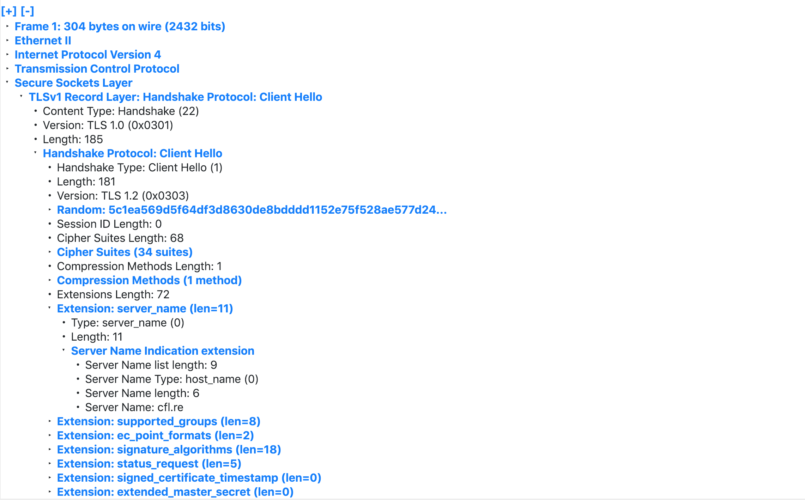

## client says hello

Given packet dump:
```
00000c07ac01784f437dbfc70800450000f2560140004006db58ac1020c843c
7f80cd1f701bbc8b2af3449b598758018102a72a700000101080a675bce16787
abd8716030100b9010000b503035c1ea569d5f64df3d8630de8bdddd1152e75f
528ae577d2436949ce8deb7108600004400ffc02cc02bc024c023c00ac009c0
08c030c02fc028c027c014c013c012009f009e006b0067003900330016009d
009c003d003c0035002f000a00af00ae008d008c008b010000480000000b
000900000663666c2e7265000a00080006001700180019000b0002010000
0d0012001004010201050106010403020305030603000500050100000000
001200000017000052305655494338795157524c656d6443436c5246574651
675430346754456c4f52564d674e434242546b51674e513d3d
```

Pass this to python:
```
>>> a="00000c07ac01784f437dbfc70800450000f2560140004006db58ac1020c843c7f80cd1f701bbc8b2af3449b598758018102a72a700000101080a675bce16787abd8716030100b9010000b503035c1ea569d5f64df3d8630de8bdddd1152e75f528ae577d2436949ce8deb7108600004400ffc02cc02bc024c023c00ac009c008c030c02fc028c027c014c013c012009f009e006b0067003900330016009d009c003d003c0035002f000a00af00ae008d008c008b010000480000000b000900000663666c2e7265000a00080006001700180019000b00020100000d0012001004010201050106010403020305030603000500050100000000001200000017000052305655494338795157524c656d6443436c5246574651675430346754456c4f52564d674e434242546b51674e513d3d"
>>> a.decode("hex")
"\x00\x00\x0c\x07\xac\x01xOC}\xbf\xc7\x08\x00E\x00\x00\xf2V\x01@\x00@\x06\xdbX\xac\x10 \xc8C\xc7\xf8\x0c\xd1\xf7\x01\xbb\xc8\xb2\xaf4I\xb5\x98u\x80\x18\x10*r\xa7\x00\x00\x01\x01\x08\ng[\xce\x16xz\xbd\x87\x16\x03\x01\x00\xb9\x01\x00\x00\xb5\x03\x03\\\x1e\xa5i\xd5\xf6M\xf3\xd8c\r\xe8\xbd\xdd\xd1\x15.u\xf5(\xaeW}$6\x94\x9c\xe8\xde\xb7\x10\x86\x00\x00D\x00\xff\xc0,\xc0+\xc0$\xc0#\xc0\n\xc0\t\xc0\x08\xc00\xc0/\xc0(\xc0'\xc0\x14\xc0\x13\xc0\x12\x00\x9f\x00\x9e\x00k\x00g\x009\x003\x00\x16\x00\x9d\x00\x9c\x00=\x00<\x005\x00/\x00\n\x00\xaf\x00\xae\x00\x8d\x00\x8c\x00\x8b\x01\x00\x00H\x00\x00\x00\x0b\x00\t\x00\x00\x06cfl.re\x00\n\x00\x08\x00\x06\x00\x17\x00\x18\x00\x19\x00\x0b\x00\x02\x01\x00\x00\r\x00\x12\x00\x10\x04\x01\x02\x01\x05\x01\x06\x01\x04\x03\x02\x03\x05\x03\x06\x03\x00\x05\x00\x05\x01\x00\x00\x00\x00\x00\x12\x00\x00\x00\x17\x00\x00R0VUIC8yQWRLemdCClRFWFQgT04gTElORVMgNCBBTkQgNQ=="
```

Pass this to xxd
```
00000000: 0000 0c07 ac01 784f 437d bfc7 0800 4500  ......xOC}....E.
00000010: 00f2 5601 4000 4006 db58 ac10 20c8 43c7  ..V.@.@..X.. .C.
00000020: f80c d1f7 01bb c8b2 af34 49b5 9875 8018  .........4I..u..
00000030: 102a 72a7 0000 0101 080a 675b ce16 787a  .*r.......g[..xz
00000040: bd87 1603 0100 b901 0000 b503 035c 7831  .............\x1
00000050: 65a5 69d5 f64d f3d8 630d e8bd ddd1 152e  e.i..M..c.......
00000060: 75f5 28ae 577d 949c e8de b710 8600 0044  u.(.W}.........D
00000070: 00ff c02c c02b c024 c023 c00a c009 c008  ...,.+.$.#......
00000080: c030 c02f c028 c027 c014 c013 c012 009f  .0./.(.'........
00000090: 009e 006b 0067 0039 0033 0016 009d 009c  ...k.g.9.3......
000000a0: 003d 003c 0035 002f 000a 00af 00ae 008d  .=.<.5./........
000000b0: 008c 008b 0100 0048 0000 000b 0009 0000  .......H........
000000c0: 0663 666c 2e72 6500 0a00 0800 0600 1700  .cfl.re.........
000000d0: 1800 1900 0b00 0201 0000 0d00 1200 1004  ................
000000e0: 0102 0105 0106 0104 0302 0305 0306 0300  ................
000000f0: 0500 0501 0000 0000 0012 0000 0017 0000  ................
00000100: 5230 5655 4943 3879 5157 524c 656d 6443  R0VUIC8yQWRLemdC
00000110: 436c 5246 5746 5167 5430 3467 5445 6c4f  ClRFWFQgT04gTElO
00000120: 5256 4d67 4e43 4242 546b 5167 4e51 3d3d  RVMgNCBBTkQgNQ==
```

Now, when parsing this packet.



This shows the [SNI](https://blog.cloudflare.com/encrypted-sni/), which is not encrypted to be `https://cfl.re`

Checking the ethernet padding, it is a base64 encoded string.
```
$ echo "R0VUIC8yQWRLemdCClRFWFQgT04gTElORVMgNCBBTkQgNQ==" | base64 -D
GET /2AdKzgB
TEXT ON LINES 4 AND 5
```

So we get the following URL: `https://cfl.re/2AdKzgB`


And the answer is
```
#    | | ::[ Dear robot ]: | |  |
#    | | ::::[ be nice ]:: | |  |
```
